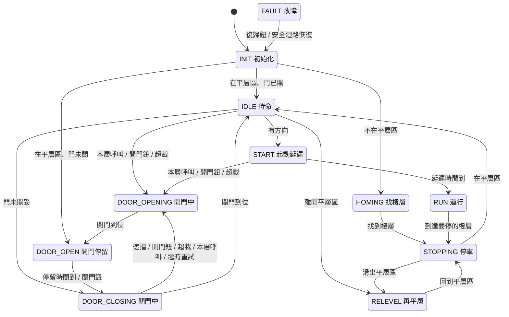

# 控制邏輯說明

本文件說明 `src/02_FB_ElevatorCtrl.st` 的內部設計。使用方式與 I/O 表請看
[README](../README.md)。

## 1. 每次掃描的執行順序

功能塊每次掃描都依固定順序執行下列 8 段，任何動作都由單一狀態 `eState` 決定：

| 段 | 內容 |
|---|---|
| 1 | 參數範圍檢查、計時器（狀態停留時間、開門停留、運行時間限制）、復歸鈕上升緣 |
| 2 | 讀取平層感測器，運行中抵達新樓層時更新 `nCurFloor` 並檢查樓層順序 |
| 3 | 故障偵測，有故障立即進入 `ST_FAULT` |
| 4 | 呼叫登記（只在正常服務中） |
| 5 | 計算目前樓層以上、以下最近的呼叫樓層 `nCallAbove`、`nCallBelow` |
| 6 | 停在樓層時決定方向，並服務本層呼叫（清除呼叫 → 開門） |
| 7 | 主狀態機 `CASE eState OF …` |
| 8 | 依狀態產生輸出，並再經過一次安全互鎖 |

計時器全部放在第 1 段、每次掃描只呼叫一次，避免在 `CASE` 分支裡呼叫計時器
造成「沒呼叫到就不會重置」的常見錯誤。狀態停留時間 `tInState` 在狀態改變時
自動歸零，所以各狀態直接用 `tInState >= 時間` 判斷逾時或延遲。

## 2. 狀態機



任何狀態偵測到故障都會直接進入 `FAULT`（圖中省略）。

| 狀態 | 輸出 | 說明 |
|---|---|---|
| INIT | 全部 OFF | 等 1 秒輸入穩定後依平層感測器判斷位置 |
| HOMING | 先關門，門關妥後低速下降（壓到下極限時改上升） | 找到任一樓層就停，並在停妥後開門 |
| IDLE | 全部 OFF | 決定方向；本層有呼叫就開門，有方向就起動 |
| DOOR_OPENING | 開門 | 開門到位 → DOOR_OPEN；8 秒未到位 → 故障 6 |
| DOOR_OPEN | 全部 OFF | 停留 3 秒；開門鈕、遮擋、超載、本層呼叫會重新計時 |
| DOOR_CLOSING | 關門 | 到位 → IDLE；8 秒未到位 → 重開重試，連續 3 次 → 故障 7 |
| START | 全部 OFF | 門關妥後等 0.5 秒再起動（期間本層有呼叫仍可重開門） |
| RUN | 上升或下降 | 每抵達一層判斷要不要停 |
| STOPPING | 全部 OFF | 煞車穩定 0.5 秒後確認是否在平層區 |
| RELEVEL | 低速，方向與上一次運轉相反 | 回到平層區就停；連續 3 次失敗 → 故障 3 |
| FAULT | 全部 OFF | 清除所有呼叫；故障 1 自動恢復，其餘按復歸鈕 |

## 3. 呼叫與方向（集選控制）

### 呼叫登記
正常服務中（不是 INIT、HOMING、FAULT）按下按鈕就設定對應的呼叫記憶並亮燈。
頂樓的上呼與底樓的下呼會被忽略。呼叫只有在「服務時」或「故障時」才會清除。

### 停在樓層時的方向判斷（第 6 段）
門已關（IDLE）時才允許改變方向；門開著時保持原方向，避免剛進車廂的乘客被
載往反方向。

```
若 方向 = 上：
    上方沒有呼叫 且 本層沒有上呼  →  本層有下呼或下方有呼叫 ? 改為「下」 : 改為「無」
若 方向 = 下：
    下方沒有呼叫 且 本層沒有下呼  →  本層有上呼或上方有呼叫 ? 改為「上」 : 改為「無」
若 方向 = 無：
    本層有上呼 → 上；本層有下呼 → 下；
    否則前往最近的呼叫（距離相同先往上）
```

接著服務本層呼叫：**車廂呼叫**，以及**與目前方向相同的廳外呼叫**。
被服務的呼叫立即清除並開門（或讓開著的門延長 / 關門中的門重開）。
方向燈就是目前的方向，所以開門時乘客看到的是電梯接下來要走的方向。

### 運行中是否停靠（RUN 狀態，抵達新樓層 f 時）

```
停 = 車廂呼叫[f]
   或 (往上 且 (上呼[f] 或 f 以上已無任何呼叫))
   或 (往下 且 (下呼[f] 或 f 以下已無任何呼叫))
```

「前方已無呼叫就停」確保電梯停在最遠的呼叫樓層後反向，也確保到了頂樓/底樓
一定會停。

### 例子
車廂在 1F，車廂內按 4F。上行經過 1F～2F 之間時，3F 有人按「上」、2F 有人按「下」：

| 位置 | 判斷 | 動作 |
|---|---|---|
| 抵達 2F | 2F 只有下呼，方向是上；上方仍有呼叫 | 通過 |
| 抵達 3F | 3F 有上呼 | 停，開門（方向燈「上」），清除 3F 上呼 |
| 抵達 4F | 車廂呼叫 4F | 停；上方已無呼叫、下方有 2F → 方向改「下」，開門 |
| 抵達 2F | 2F 有下呼 | 停，開門（方向燈「下」） |

## 4. 門控制

- 開門只在「車廂停止」且「在平層區」時輸出（第 8 段互鎖）。
- 關門中遇到遮擋、開門鈕、超載或本層呼叫 → 立刻反向開門。
- 開門停留期間有上述情況 → 停留時間重新計算；超載時關門鈕無效並鳴蜂鳴器。
- 關門逾時不直接報故障，先重新開門再關（常見原因是門口有東西卡住），
  連續失敗 `nDoorRetryMax` 次才報故障 7。
- 找樓層時車廂不在平層區，只能關門不能開門；遇到遮擋時暫停關門。

## 5. 位置

- 每層一個平層感測器，車廂位於該層平層區時 ON。同時只能有一個 ON，
  兩個以上 → 故障 3。
- 運行中只接受「下一層」（上行 +1、下行 −1）；跳層代表感測器漏訊號或配線錯誤
  → 故障 3。停止或再平層時出現別的樓層也是故障 3。
- 位置不明（上電在兩層之間、故障復歸後）→ HOMING 低速找樓層。
- 停車後若滑出平層區 → RELEVEL 反方向低速回到平層區。

## 6. 安全與故障

第 3 段依以下優先順序偵測，偵測到就進入 FAULT：

1. 安全迴路斷開（故障 1）
2. 運轉中關門到位消失，或開門到位、關門到位同時 ON（故障 5）
3. 運轉方向的極限開關動作（故障 4）
4. 平層感測器同時 ON / 順序錯誤（故障 3）
5. 運行時間限制：馬達運轉中，每抵達一層重新計時；高速超過 `tRunTimeout`、
   低速超過 `tSlowTimeout` → 故障 2

各狀態內另外偵測：開門逾時（6）、關門失敗（7）、再平層失敗（3）、
起動方向的極限已動作（4）。

第 8 段輸出前再做一次互鎖，即使狀態機有錯也不會違反：

```
上升 = 命令上升 且 安全迴路正常 且 關門到位 且 上極限正常 且 非故障
下降 = 命令下降 且 安全迴路正常 且 關門到位 且 下極限正常 且 非故障
開門 = 開門中 且 在平層區 且 安全迴路正常 且 馬達停止 且 未開到位
關門 = (關門中 或 找樓層關門) 且 安全迴路正常 且 未開門 且 未關到位
```

上升/下降由同一個方向變數產生，程式上不可能同時 ON；硬體仍須互鎖。

## 7. 時序範例

模擬條件：樓高 3 m、車速 1 m/s、開關門各 2 秒。車廂停在 1F 待命，
t = 0 時按車廂 3F：

| 時間 (s) | 狀態 | 輸出 / 顯示 |
|---|---|---|
| 0.01 | START | 3F 車廂燈亮、上行方向燈亮 |
| 0.53 | RUN | 馬達上升 |
| 3.51 | RUN | 通過 2F（樓層顯示 2） |
| 6.51 | STOPPING | 抵達 3F，馬達停止 |
| 7.03 | IDLE | 3F 已無後續呼叫 → 方向改為無 |
| 7.04 | DOOR_OPENING | 開門，3F 車廂燈熄、方向燈熄 |
| 9.04 | DOOR_OPEN | 開門到位，停留 3 秒 |
| 12.05 | DOOR_CLOSING | 關門 |
| 14.05 | IDLE | 關門到位，待命 |

## 8. 改寫成階梯圖

只能寫階梯圖的 PLC 可以照同樣的結構改寫：

- **呼叫記憶**：每個按鈕一個 M 點，按鈕 ON → SET；服務時 RST。
- **狀態**：每個狀態一個 M 點（例如 M100 = IDLE、M101 = DOOR_OPENING …），
  每條轉移寫成「目前狀態 M 點 + 條件 → SET 下一狀態、RST 目前狀態」。
- **計時器**：各狀態的延遲/逾時用該狀態 M 點驅動計時器線圈，狀態離開時自動復歸。
- **方向**：上、下兩個 M 點，依第 3 節的規則在待命時 SET/RST。
- **輸出**：依狀態 M 點與第 6 節的互鎖條件串聯後驅動 Y 輸出。
