# 4 層電梯 — 三菱 FX3U 階梯圖

由 `sim/render_ladder.py` 依 [`elevator_fx3u.txt`](elevator_fx3u.txt) 自動產生，請勿手動修改。完整說明見 [README](README.md)，也可以下載 [ladder.html](ladder.html) 用瀏覽器開啟。

## 0. 上電初始化

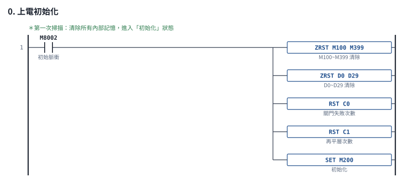

## 1. 故障復歸鈕

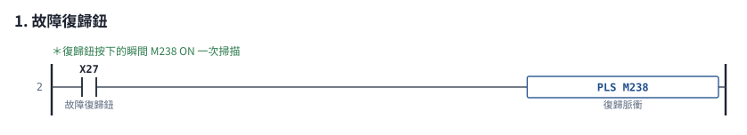

## 2. 平層感測器

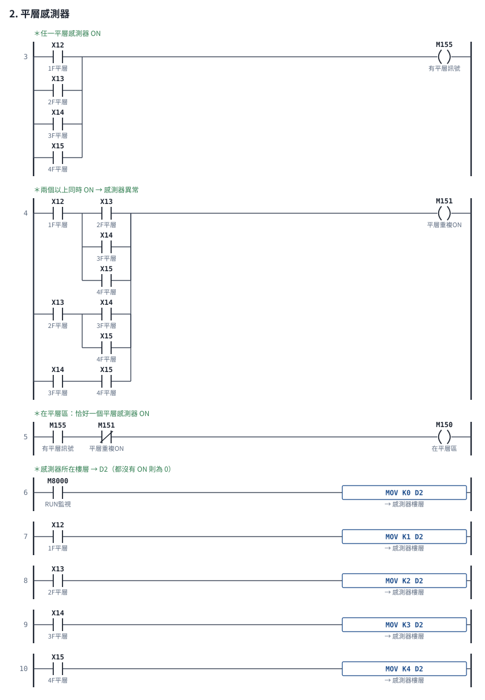

## 3. 樓層追蹤

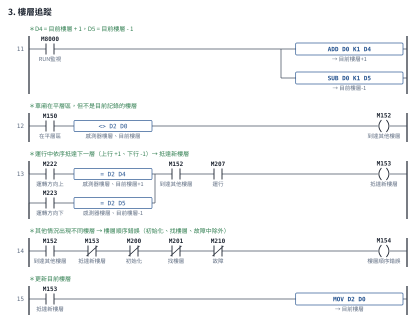

## 4. 運行時間限制（每抵達一層重新計時）

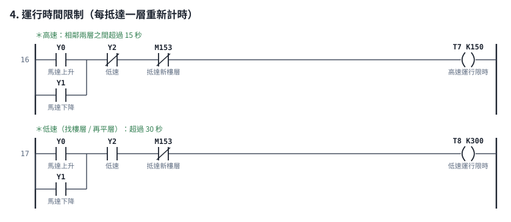

## 5. 故障偵測

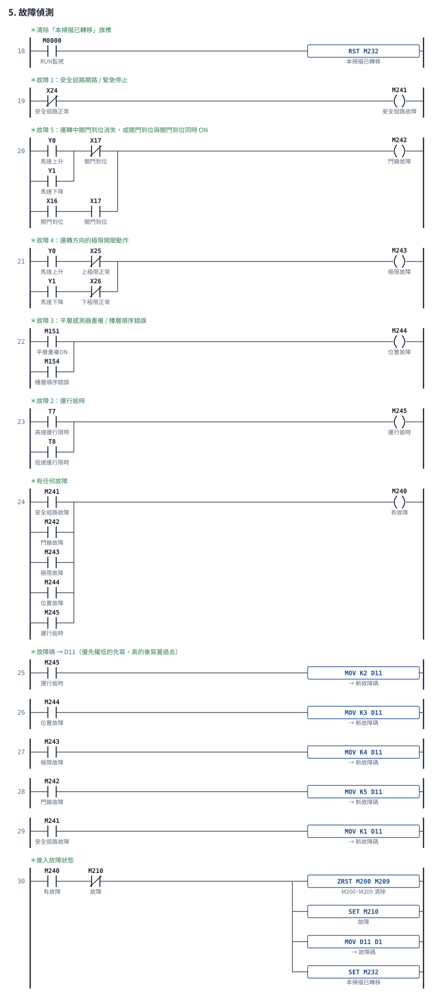

## 6. 呼叫登記（正常服務中才接受）

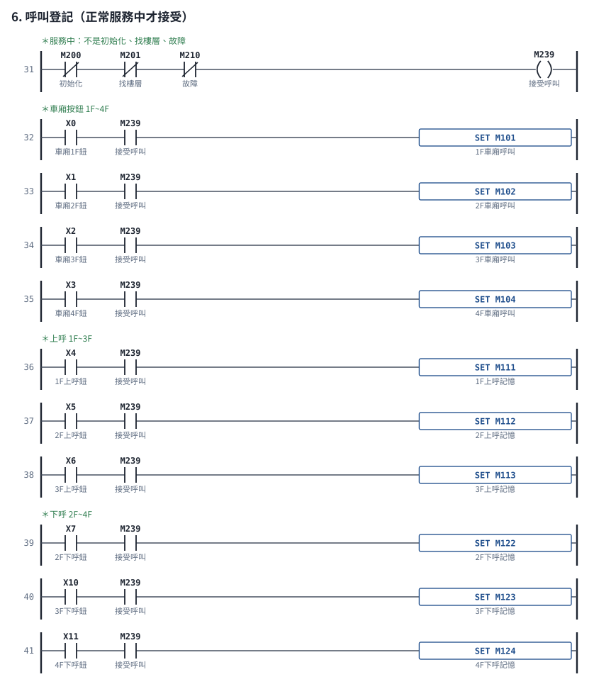

## 7. 呼叫整理

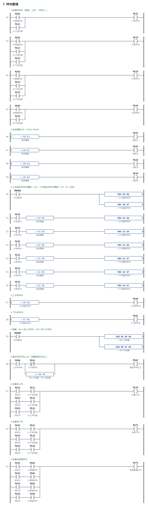

## 8. 停在樓層：決定方向並服務本層呼叫

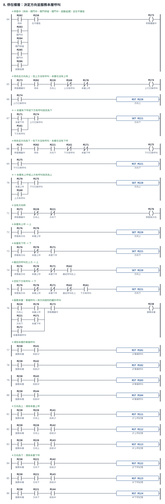

## 9. 計時器與條件

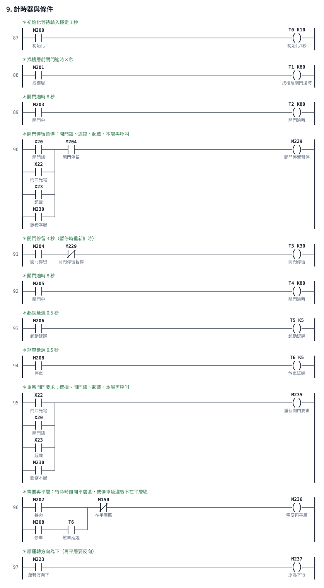

## 10-1. 狀態：初始化 M200

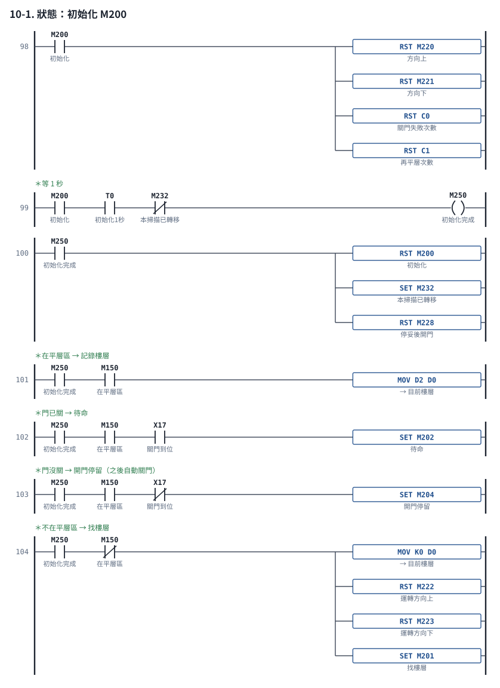

## 10-2. 狀態：找樓層 M201

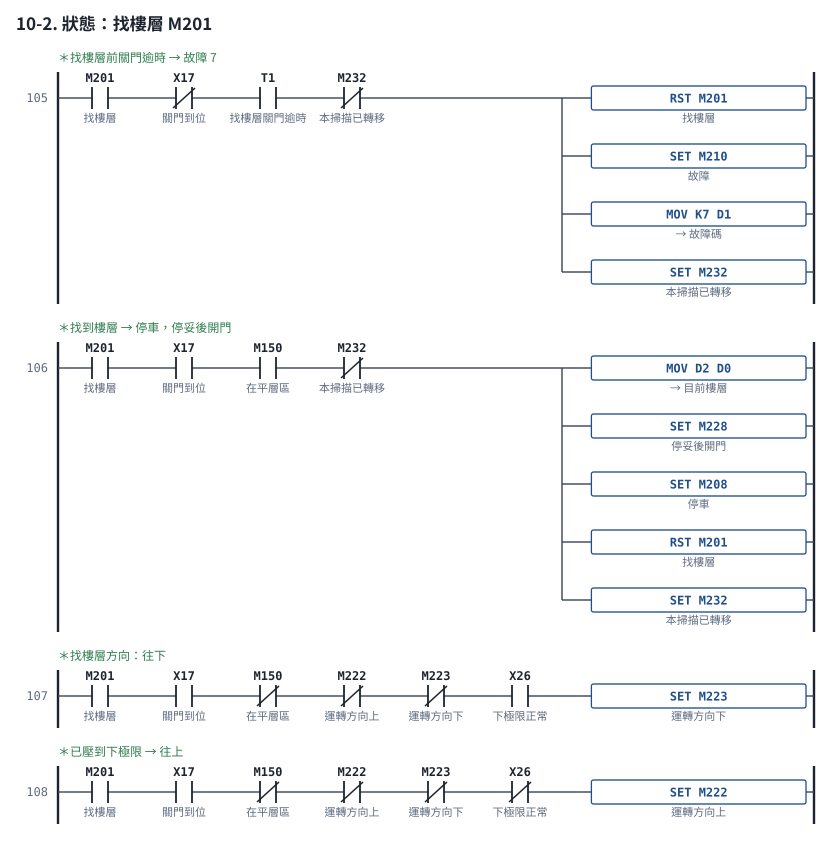

## 10-3. 狀態：待命 M202

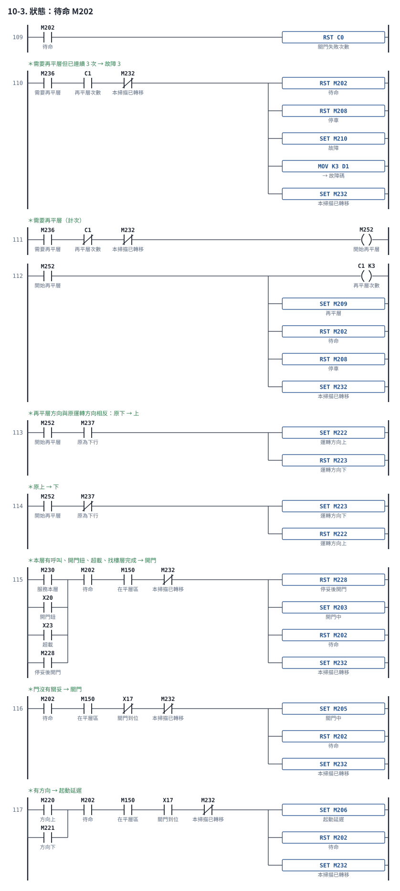

## 10-4. 狀態：開門中 M203

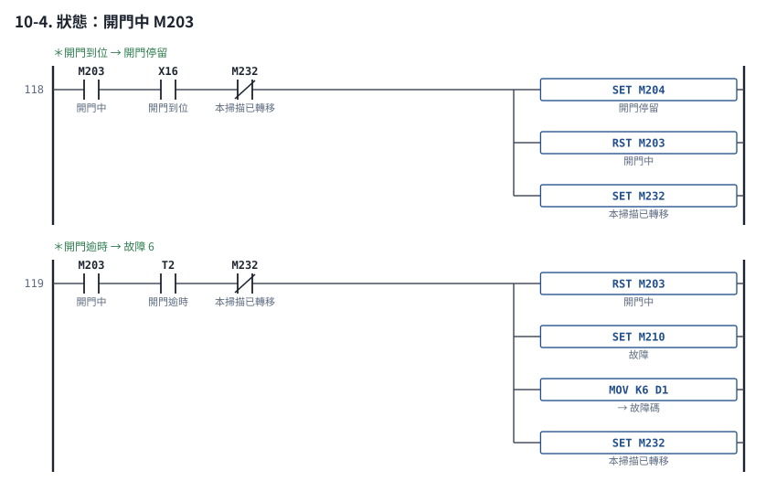

## 10-5. 狀態：開門停留 M204

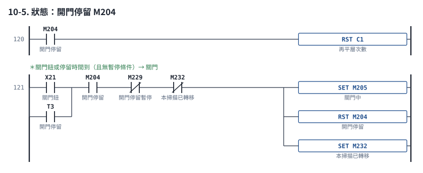

## 10-6. 狀態：關門中 M205

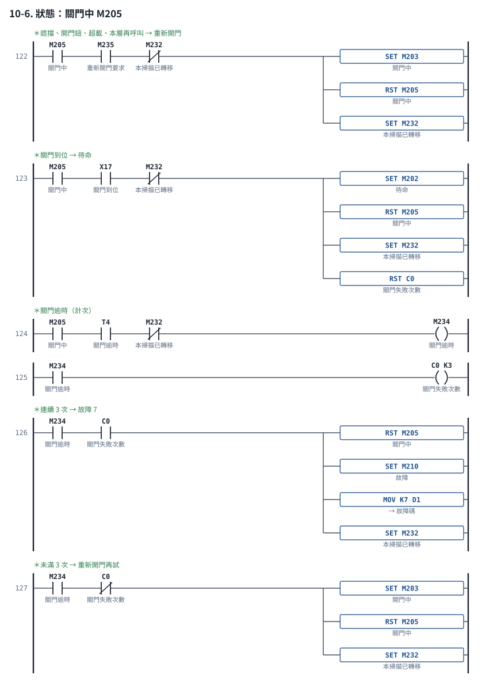

## 10-7. 狀態：起動延遲 M206

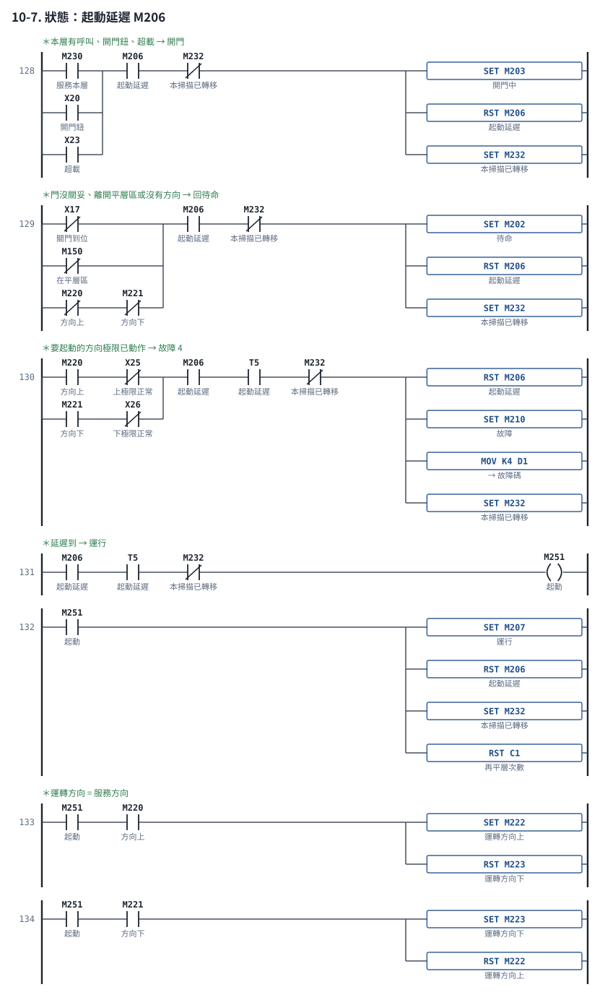

## 10-8. 狀態：運行 M207

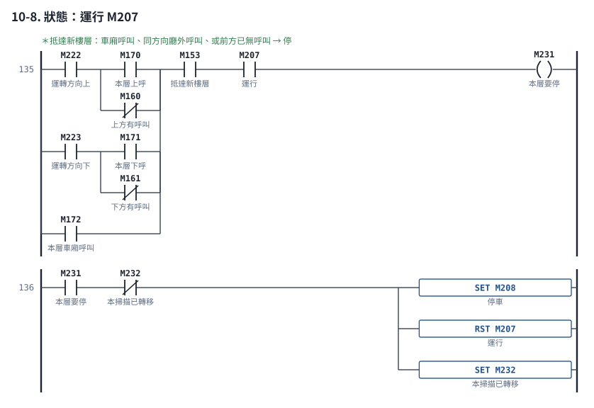

## 10-9. 狀態：停車 M208

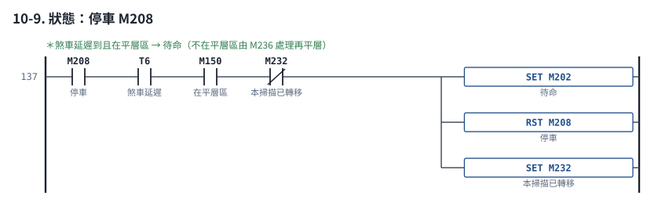

## 10-10. 狀態：再平層 M209

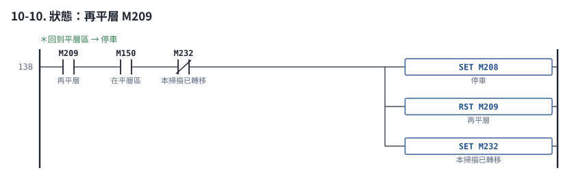

## 10-11. 狀態：故障 M210

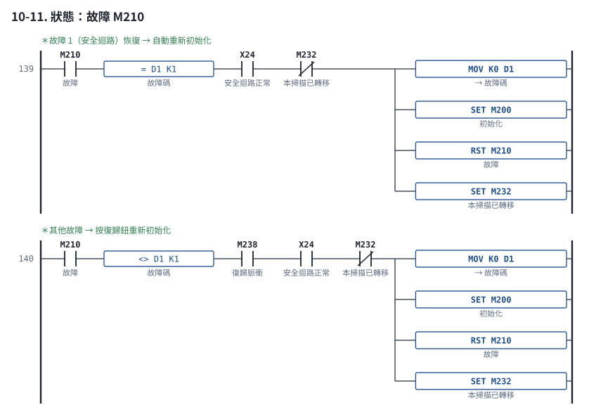

## 11. 故障中：清除所有呼叫與方向

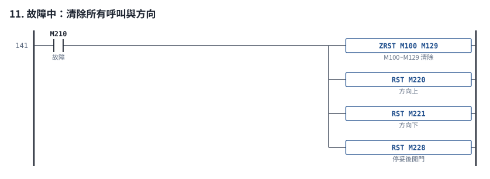

## 12. 輸出

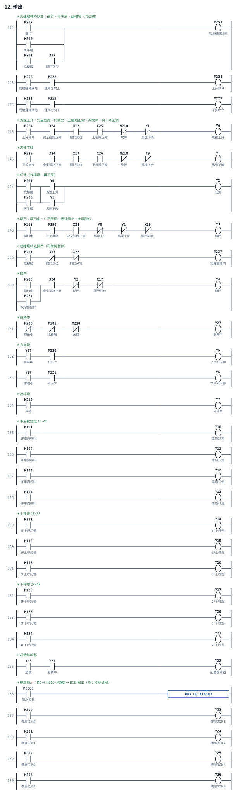
